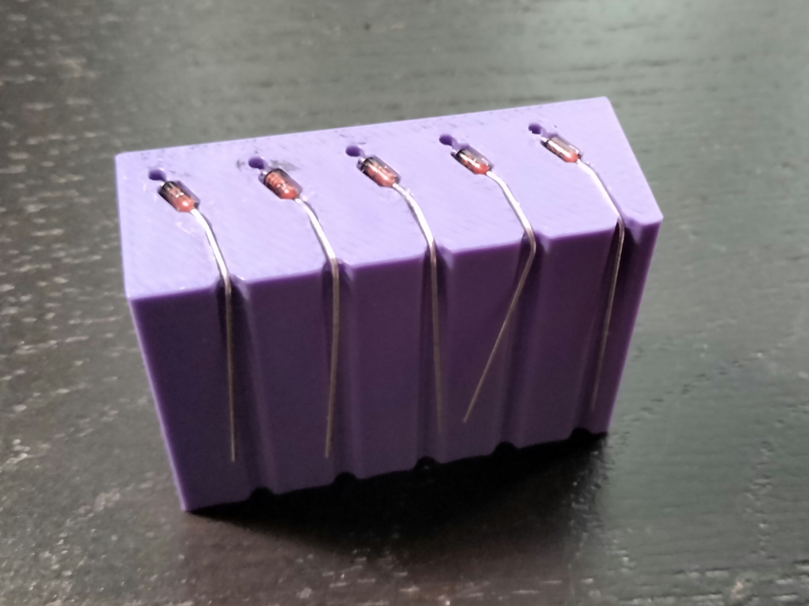
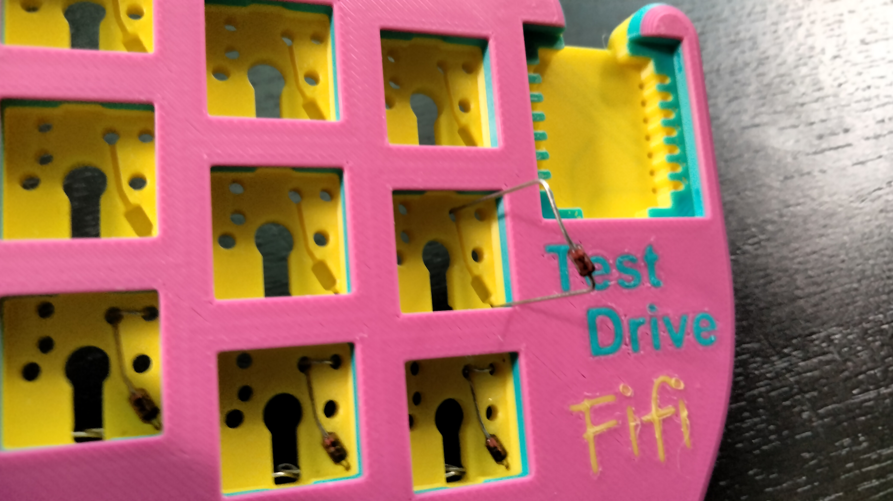
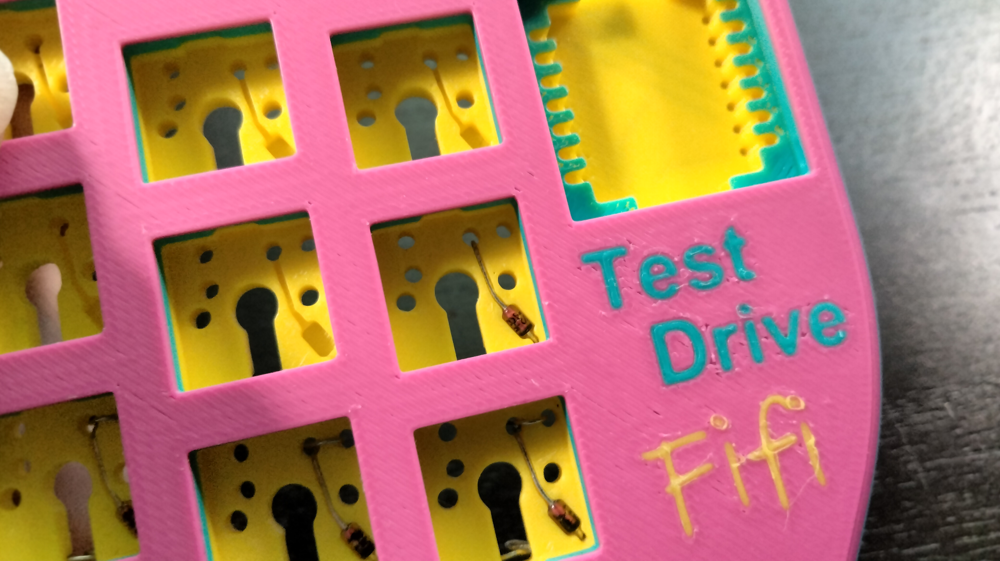
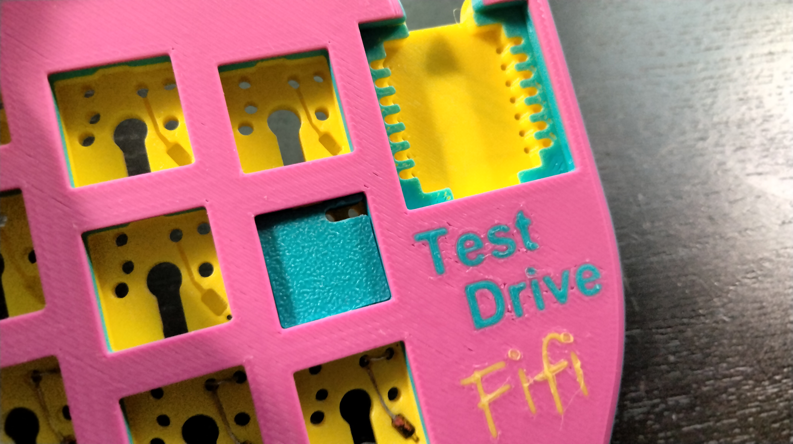
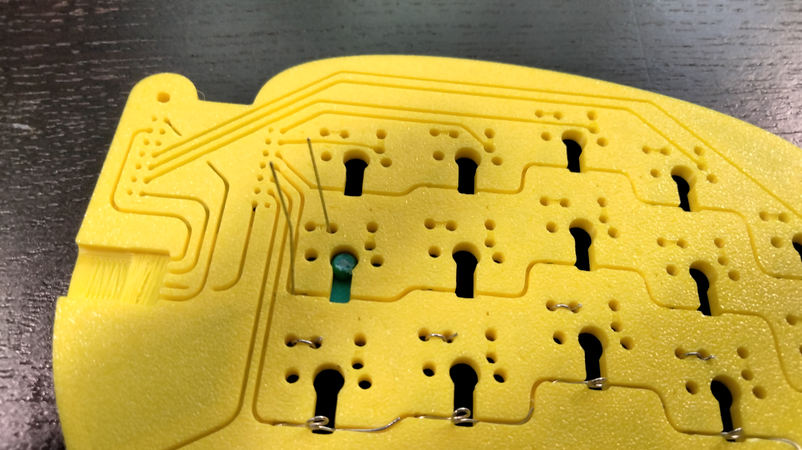
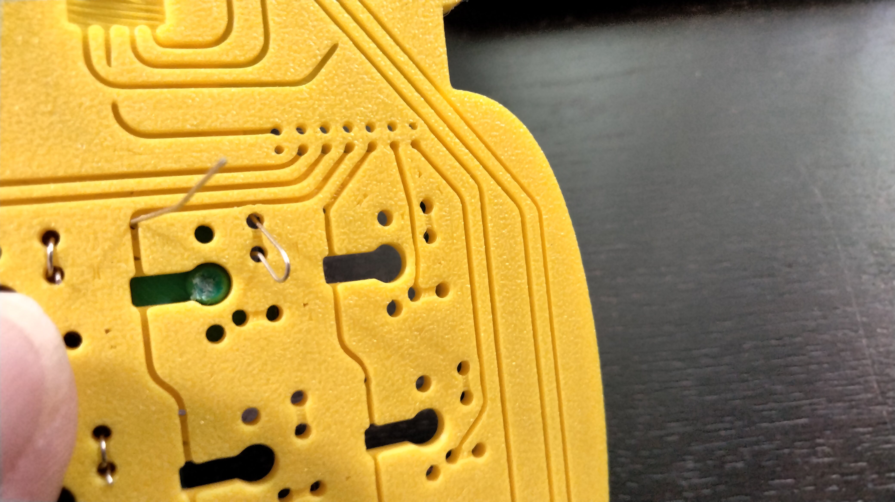
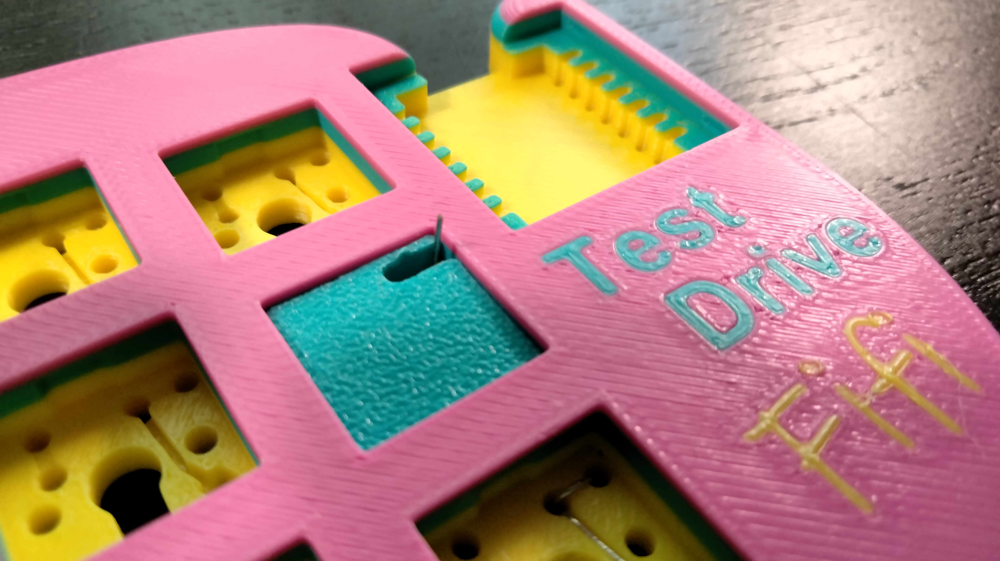

# Assembling a TestDrive Keyboard

This document will guide you through the assembly of a TestDrive keyboard.

All TestDrive keyboards are assembled the same way. The only differences are the Development board used, and the key positions. Wire routing is defined and enforced by the printed bodies.

## Required Materials

1. 3d Printed Parts - Left and Right Bodies and Bottom Covers, optionally MCU covers.
2. Two (2) Development Boards matching the board design.
3. Two USB-C Female Sockets with four pad PCB like this https://a.co/d/as5VxVV
4. Keyswitches of choice x number of keys
5. 1N4148 Diodes x number of keys. I reccomend purchasing a few extra, they are cheap and invariably one or more will get misbent.
6. 22 AWG Solid Tinned Bus Bar Wire. About 10 feet/3 meters. I recomend buying a spool. If for some reason you cannot find Bus Bar Wire, you can use solid core wire and strip the insulation. This is a lot of work but it does work, my first build was done this way!
7. Four M3x5 Button Head screws.
8. One usbc-usbc cord to connect the halfs. As long or short as you want.

## Printing

The TestDrive boards require a fairly well calibrated 3d printer, as the wire tracks are intentionally snug. Print with both the main body and the bottom cover facing up.

The additional tools in the [Tools](/TestDrive/Tools/) Directory are optional but highly recomended. Be sure to insert an M2x20 screw through the WireWrapFixture.

## Assembly
### Overview

1. Solder leads to USB-C Sockets.
2. Insert Diodes
3. Wire Rows and Columns
4. Insert USB-C Sockets and run leads
5. Insert development/mcu boards
6. Insert keyswitches
7. Flash Firmware
8. Test and Tweak

### Solder USB-C Sockets

Measure eight pieces of Bus Wire 3 in/8 cm each, and solder one to each pad of the socket pcbs. Wire shouuld be roughly centered on each pad. Set aside for later.

### Install Diodes

This is the most tedious part of the process, so get a beveage of your choice, turn on your working music, and get comfortable.

I recomend using the DiodeBender from this repository to pre-bend 5 diodes at a time. This makes the process a bit smoother, and also makes it easier to not get the orientation of the diodes wrong.

Insert the diodes into the DiodeBender with the black stripe (Cathode/negative) down into the enclosed hole, bend the diode down to press the body into the larger rectangular hole in the jig, then run the other lead (Anode/positive) through the channel to the edge of the jig and bend down the side through the channel. Shape 5 diodes at a time, or all of them.

For each keysocket, we will place one diode in the track in the bottom of the socket with the black stripe/straight lead through the hole in the bottom right corner of the socket, and the other lead through the hole at the end of the channel, and press the diode and lead into the impression in the bottom of the board.

    
    

Press the Diode Clamp into the top of the socket. There is a tab that goes into the channel at the south side of the socket, and a notch that faces to the right at the north side of the socket. This holds the diode in place while you weave the leads through.

From the back side of the board, thread the lead back through the other hole near the pin hole, leading back into the socket. You will need to work the wire to thread it all the way through.

    
    
    

Insert the wire wrap fixture on the back of the board. This helps hold the diode in place as you wind the wire back down again.

Wrap the other (straight/cathode) lead around the screw once to form a loop. Slide off the screw and press into the channel. You may need to trim the lead slightly. The loop should be centered in the opening around the center pin hole.

Back on the front of the board, pull the wire through, and bend over to push back throug the original hole once again. You can use the channel in the diode clamp as a guilde.

Once through to the back agian, simply pull towards the other hole and trim off.

Repeat this process for each socket.

### Wire Rows and Columns

Take a piece of bus wire off the spool. Most of the wires are 6 in/ 15 cm or less. On some boards, you may need a little more. Use good judgement, or just get a longer piece if its too short!

Look at the wire traces, we want to place the rows first, as they must ride under the columns. Look at where the first row trace starts where the development board will go, see where the trace leads to one of the holes. insert the wire in the hole, pulling about 1 inch / 2.5 cm through, bending over about half and inserting back through the other hole next to the one you came up through. This will form the spring contact to connect to the board.

Back on the back side of the board, work the wire into the channel. Depending on the print, it may be quite tight.. it will take some practice to get them in the channel well. You can use a plastic spadger, Wood Stick, small screwdriver.. I actually usually start them with my needle nose pliers, running the side on top of the wire along the channel. As you pass the diode loops, run the row wire on the north side of the loop, so that when you are done you can fold the loop down over the row wire.

Run the wire to the end of the channel and trim off the end. Double check the wire is fully seated.. this is important as the column wires will pass over and cannot contact them.

Finally go back to the mcu socket and fold over the other end of the wire, trimming so it is enough to secure the wire but not get in the way. Some of the newer designs have a slot to push this end down into, trim the wire to fit in these cases.

Repeat for all rows.

To run the column wires, the process is similar to the top socket in each column. Start at the mcu socket end, create the spring pin, then run through the channel to the pin hole on the top socket. Here you will run the wire through the board, thread around to the other hole, pull back through the board to the back, then run the lead down to the next socket, and down through the more south of the pin holes, and repeat for all sockets of the column. 

The three innermost columns for most boards will also be the thumb cluster switches, simply continue the column down to the corresponding thumb cluster socket.

After the last socket, when the wire returns to the back of the board, pull under the lead that came down from the previous socket and twist the wire over to secure and cut off remainder.

Repeat for all columns.

Note that for some boards, such as the Klor Konrad, extra keys may be wired off of the fourth and fifth columns.. you will see channels in the board similar to the row traces to connect the columns.. simply run the wire through that channel and loop through the extra key socket as you would at the end of a column.

### Wire the USB socket

Press the USB socket in place with the solder pads up. Run the leads through the channels to the devboard and thread the wire through the hole at the end of the channel. fold the wire over and pull back down through the other hole, pull tight, fold over and trim.

Note that the order of wires may sometimes need to be altered to allow for wires that go over to be after wires that go under.. use good judgement. Every board is a little different.

### Insert Development Board

Press a development board into each half socket. If you find the socket is too tight, use a screwdriver to press inward slightly where the board will sit. Make small adjustments and retry each time.

Once the board is in place, it is helpful to use a multimeter to make sure each pin is contacting the board. Easiest is to check for continuity between the pad at the top of the board, and the lead on the side. Be careful to not push to hard on the lead, as it could bend in and give a false positive circut. 

Adjust the wire for any lead that is not contacting, until all work.

### Insert Keyswitches

Insert keyswtiches in the board by aligning the pins and pressing as straight down as possible.

### Flash Firmware

Flash the apporpriate firmware to the boards

### Test and Adjust

Try your keyboard! If you find entire rows or columns not working, one of the pins is probably not contacting the dev board. If less than an entire row or column is not working, one of the keys pins is not quite making contact. Most commonly its the left pin. Pull out the switch and give the left pin a slight tweak toward the north. Reinsert the switch and retest.

If that dosnt help, you can try adjusting the right pin slightly south. These two adjustments will usually resolve contact issues.